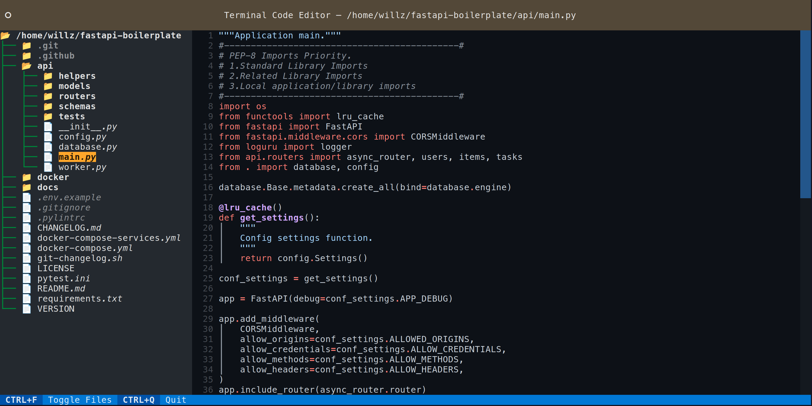

# TCE - Terminal Code Editor



TCE is a Terminal Code Editor

## Install

The package can be installed through `pip`, example:

```bash
pip install tce
```

## How to Use

Simply run TCE within the directory of the project you wish to work on, example:

```bash
cd my_code/
tce
```
